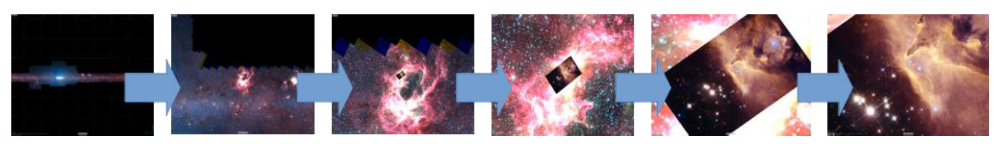
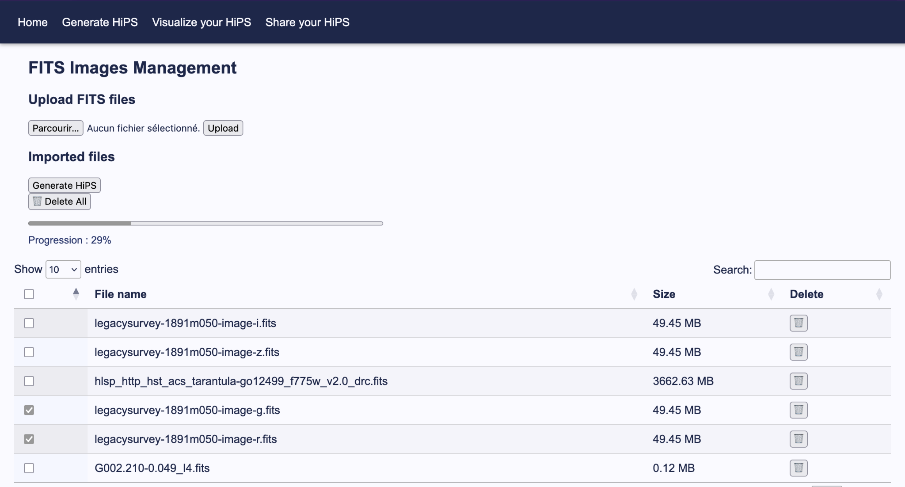
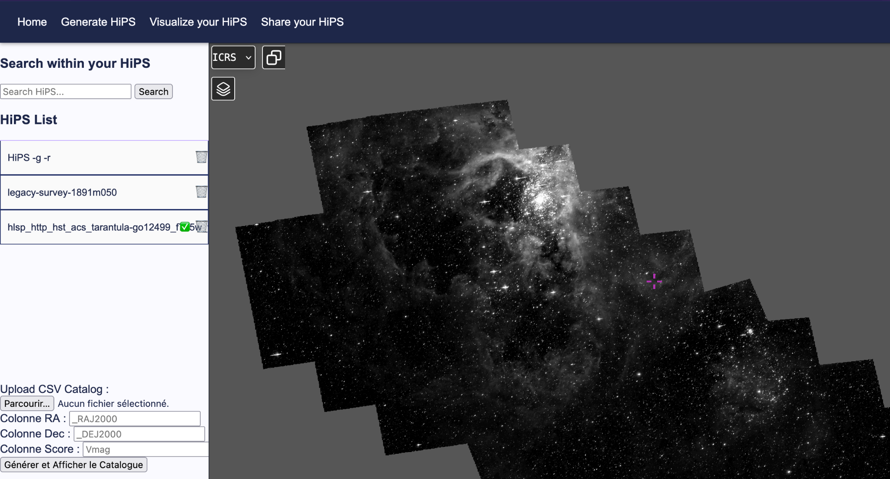

# Aladin Lite Visualizer (Web App)

[](https://flask.palletsprojects.com/)
[](https://aladin.cds.unistra.fr/AladinLite/OSSR/)
[]()

> Un prototype d'application web full stack permettant aux chercheurs d'uploader leurs données d'images astronomiques, les traiter et les visualiser de manière interactive dans le navigateur grâce au moteur **Aladin Lite v3**.

## Que sont les FITS et les HiPS ?

- **FITS (Flexible Image Transport System)** : Format de fichier standard pour le stockage et le transport d'images astronomiques. Il contient des données brutes issues des observations, souvent volumineuses et complexes à manipuler directement.
- **HiPS (Hierarchical Progressive Surveys)** : Format de données optimisé pour la visualisation rapide de grandes images astronomiques. Il permet un rendu progressif et efficace, idéal pour les applications web comme Aladin Lite.

Les HiPS sont basés sur le même principe que les tuiles utilisées dans les cartes en lignes (google maps, openstreetmap, etc.) : les images sont découpées en petites tuiles à différents niveaux de zoom, ce qui permet un chargement rapide et une navigation fluide. Les détails des cartes sont chargés à la demande, en fonction du niveau de zoom et de la zone d'intérêt de l'utilisateur.

**Hipsgen** est l'outil Java utilisé pour automatiser la conversion des fichiers FITS en format HiPS. Cette application intègre Hipsgen pour offrir un pipeline de traitement automatisé et transparent aux utilisateurs.


_Image provenant du document "[HiPS – Hierarchical Progressive Survey](https://www.ivoa.net/documents/HiPS/20170406/PR-HiPS-1.0-20170406.pdf)" de l'IVOA_

## Captures d'écrans du projet

| Ecran de gestions des FITS et génération des HiPS | Ecran de visualisation des HiPS générés  |
| :------------------------------------------------ | :--------------------------------------- |
|           |  |

## À propos du projet

Cet outil a été développé lors de mon stage au **Centre de Données astronomiques de Strasbourg (CDS)**.
Aladin Lite est le moteur de visualisation de HiPS pré-existant développé par le CDS (Centre des Données astronomique de Strasbourg). Ce projet vise à créer une interface web complète pour permettre aux chercheurs de tirer parti de ce moteur de visualisation puissant, en leur offrant une solution clé en main pour gérer leurs données d'images astronomiques.

Il permet aux chercheurs de télécharger leurs propres fichiers FITS, de les convertir en format HiPS sur le backend, et de les visualiser de manière interactive dans le navigateur.

1. **Upload:** Transfert sécurisé des fichiers du client vers le serveur.
2. **Processing:** Conversion des images FITS en format HiPS (Hierarchical Progressive Surveys) sur le backend.
3. **Visualization:** Rendu dynamique utilisant l'API Aladin Lite V3.

## Fonctionnalités Clés

- **Conversion de FITS à HiPS via Hipsgen** : Pipeline automatisé basé sur l'outil Hipsgen pour traiter les images astronomiques avec précision.
- **Visualiseur interactif** : Zoom, pan, et changement de types de projection (basé sur Aladin Lite).
- **Traitement asynchrone** : Gestion des tâches en arrière-plan pour les fichiers lourds afin de garder l'interface réactive.
- **Système de partage** : Génération d'URL uniques pour partager une selection de vues avec d'autres chercheurs.

## Séparation des utilisateurs

Ce projet est conçu pour être utilisé par plusieurs chercheurs, chacun ayant son propre espace de travail isolé. Les fichiers FITS téléchargés et les HiPS générés sont stockés dans des répertoires séparés pour chaque utilisateur, garantissant ainsi la confidentialité et la sécurité des données.

À la première connexion, un nouvel espace de travail est créé pour l'utilisateur, un identifiant unique uuid lui est attribué. Les fichiers FITS téléchargés sont stockés dans un répertoire dédié à cet utilisateur, et les HiPS générés à partir de ces fichiers sont également organisés dans des sous-répertoires spécifiques. Cela permet de maintenir une séparation claire entre les données de différents utilisateurs, tout en facilitant la gestion et l'accès à leurs propres fichiers et visualisations.

Pour le partage des HiPS, une URL unique, basée elle aussi sur un uuid, est générée pour chaque partage. Permettant aux chercheurs de partager facilement leurs visualisations avec d'autres, tout en maintenant la sécurité et la confidentialité des données.
Le stockage des informations de partage, quel fichiers et quel uuid de partage, est géré dans un fichier JSON sur le backend, assurant une gestion efficace et sécurisée des partages entre utilisateurs.

Lors de la suppression d'un partage le json supprime aussi l'existence de ce partage, garantissant ainsi que les données partagées ne sont plus accessibles une fois le partage supprimé.

## Architecture Technique

### Structure du projet

Ce projet est organisé de manière à séparer clairement les différentes responsabilités entre le backend et le frontend, tout en intégrant de manière transparente le moteur de visualisation Aladin Lite v3.

```bash
AladinLiteVisualizer/
├── app.py              # Point d'entrée de l'application Flask
├── HiPS/               # Stockage des fichiers HiPS générés séparés par utilisateur
├── templates/          # Fichiers HTML pour les différentes pages de l'application
├── uploads/            # Stockage des fichier FITS séparés par utilisateur
└── requirements.txt    # Dépendances Python pour le backend
```

### Technologies Utilisées

- Backend: Python 3.10+, Flask (Web Server), Astropy (FITS handling)
- Frontend: HTML5, CSS3, JavaScript
- Core Engine: Aladin Lite v3 (WebGL2/Rust)
- Conversion FITS→HiPS: Hipsgen (outil Java développé par le CDS)

## Prérequis

Avant de commencer, assurez-vous d'avoir installé sur votre ordinateur :

- **Python 3.8+** (`python3 --version`)
- **Java** (JRE ou JDK 11+) - nécessaire pour Hipsgen.jar (`java -version`)
- **Git** (optionnel, pour cloner le repo)
- Un navigateur web moderne (Chrome, Firefox, Safari, Edge)

## Installation & Mise en Place

Pour installer et exécuter ce projet localement, suivez les étapes ci-dessous :

1. Cloner le dépôt GitHub

```bash
git clone [https://github.com/lilou-cb/AladinLiteVisualizer.git](https://github.com/lilou-cb/AladinLiteVisualizer.git)
cd AladinLiteVisualizer
```

2. Mettre en place un environnement virtuel Python

```bash
# Mac/Linux
python3 -m venv env

# Windows
py -m venv env
```

3. Activer l'environnement virtuel

```bash
# Mac/Linux
source env/bin/activate

# Windows
env\Scripts\activate
```

4. Installer les dépendences python

```bash
pip install -r requirements.txt
```

5. Lancer l'application

```bash
python3 app.py
```

Ouvrez votre navigateur à http://127.0.0.1:5000

⚖️ License & Credits

- Auteure : Lilou Choukroun--Balzan
- Aladin Lite Engine: développé au CDS, sous licence GPL v3.0.
- Voir le dépôt officiel d'Aladin Lite pour le code source du moteur de visualisation.

Développé pour l'observatoire astronomique de strasbourg et le CDS - 2025
